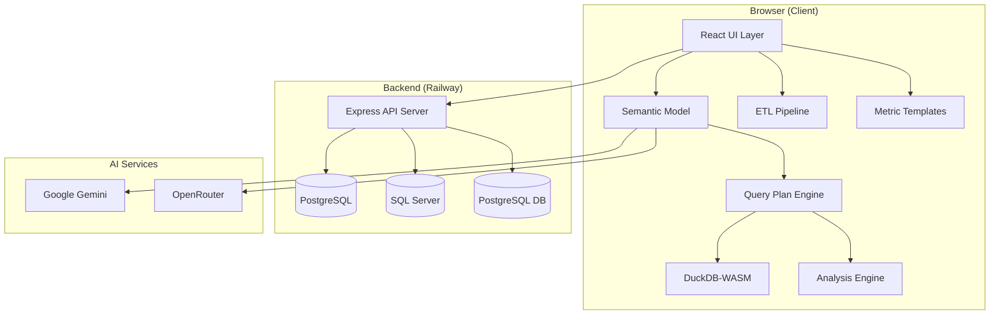

# ASTRABI Analytics — Application Documentation

> **⚠️ This document is partially out of date.**
> For the current architecture and how each engine works, see
> **[ARCHITECTURE.md](./ARCHITECTURE.md)** — that is the source of truth.
> This file is kept for the background detail it still covers accurately.

## Part 1: Overview & Architecture

---

## 1. Product Overview

**ASTRABI Analytics** (branded as **QuickInsight**) is an AI-powered business intelligence platform that transforms raw datasets into actionable insights without requiring SQL knowledge or technical expertise.

**Live URL**: [https://quickinsight.co.uk](https://quickinsight.co.uk)

### Core Value Proposition

> Upload any dataset → AI understands your data → Ask questions in plain English → Get instant visualizations and answers.

### Key Capabilities

| Capability | Description |
|-----------|-------------|
| **CSV/Excel Upload** | Drag-and-drop file ingestion with automatic ETL |
| **Live Database Connections** | Connect directly to PostgreSQL and SQL Server |
| **AI Semantic Profiling** | Auto-detects domain, column types, and business meaning |
| **Question Builder** | Point-and-click analysis with aggregations, filters, time grains |
| **Natural Language Queries** | Ask questions in plain English ("What were total sales last quarter?") |
| **AI SQL** | Ask in plain English; the AI writes and runs the SQL. Each question is answered standalone — there is no conversation memory. |
| **Interactive Dashboard** | Pin visuals, drag-resize layouts, apply global filters |
| **Metric Dictionary** | 300 curated business metric templates across 6 industries |
| **Smart Questions** | AI-generated analysis suggestions based on dataset context |
| **Alerts & Monitoring** | Threshold and trend-based business rule alerts |
| **Data Masking** | PII detection and anonymization for data privacy |
| **ETL Pipeline** | Automated data cleaning, type casting, and transformation |

---

## 2. Technology Stack

### Frontend

| Technology | Purpose |
|-----------|---------|
| **React 18** | UI framework |
| **TypeScript 5.8** | Type-safe development |
| **Vite 6** | Build tool and dev server |
| **Chart.js 4** + react-chartjs-2 | Charting (bar, line, pie, scatter, treemap, etc.) |
| **react-grid-layout** | Drag-and-drop dashboard grid |
| **react-simple-maps** | Geographic map visualizations |
| **DuckDB-WASM** | In-browser SQL engine for local analysis |
| **Framer Motion** | Animations and transitions |
| **Lucide React** | Icon system |
| **Zustand** | Lightweight state management |
| **xlsx** | Excel file parsing |
| **html2canvas** | Screenshot/export functionality |

### Backend

| Technology | Purpose |
|-----------|---------|
| **Node.js + Express** | API server |
| **PostgreSQL** | User authentication database |
| **mssql / pg** | Live database connectors |
| **bcrypt** | Password hashing |
| **JWT** | Session tokens |
| **CORS** | Cross-origin security |

### AI Services

| Provider | Usage |
|---------|-------|
| **Google Gemini** (primary) | Semantic profiling, SQL generation, explanations |
| **OpenRouter** (fallback) | Backup AI endpoint for reliability |

### Deployment

| Service | Purpose |
|--------|---------|
| **Vercel** | Frontend hosting (auto-deploy from GitHub) |
| **Railway** | Backend API hosting + PostgreSQL |
| **GitHub** | Source control |

---

## 3. Architecture Overview



### Data Flow

1. **Ingestion** → User uploads CSV/Excel or connects to live database
2. **ETL** → Automated cleaning: type detection, null handling, deduplication, date parsing
3. **Semantic Profiling** → AI analyzes column metadata to determine domain, types, and business roles
4. **Semantic Model** → Deterministic model built from AI profile: dimensions, metrics, dates, measures
5. **Query Plan** → User questions compiled into structured query plans
6. **Execution** → DuckDB-WASM executes SQL locally (import mode) or backend proxies to live DB
7. **Visualization** → Chart recommender selects optimal chart type, data is rendered
8. **Dashboard** → Visuals pinned to interactive, resizable dashboard grid

---

## 4. Project Structure

```
astrabi-analytics/
├── App.tsx                    # Root application component (82KB)
├── index.tsx                  # React entry point
├── index.html                 # HTML shell
├── index.css                  # Global styles
├── types.ts                   # Core TypeScript interfaces (Dataset, Column, etc.)
├── vite.config.ts             # Vite build configuration
│
├── components/                # 48 React components
│   ├── Sidebar.tsx            # Navigation sidebar
│   ├── Dashboard.tsx          # Drag-resize dashboard grid
│   ├── BuilderView.tsx        # Question Builder UI
│   ├── QuestionBuilder.tsx    # Query configuration panel
│   ├── NLQView.tsx            # Natural Language Query interface
│   ├── AISQLChat.tsx          # AI SQL conversational chat
│   ├── AISQLView.tsx          # AI SQL results view
│   ├── ChartVisualization.tsx # Chart rendering (94KB)
│   ├── DerivedColumnsView.tsx # Metric Dictionary UI
│   ├── ETLView.tsx            # ETL pipeline inspector
│   ├── AlertsView.tsx         # Alert management
│   ├── AlertRuleWizard.tsx    # Alert rule builder
│   ├── ConnectorsPanel.tsx    # Database connection UI
│   ├── ColumnMappingWizard.tsx# Schema mapping wizard
│   ├── Workbench.tsx          # SQL workbench (114KB)
│   ├── DataExplorerView.tsx   # Dataset exploration
│   ├── SmartQuestionsView.tsx # AI-generated question suggestions
│   ├── LoginPage.tsx          # Authentication UI
│   ├── UserManagement.tsx     # Admin user management
│   └── charts/               # Chart sub-components
│
├── services/                  # 38 service modules
│   ├── ai-sql/               # AI SQL pipeline (21 files)
│   │   ├── pipeline.ts       # Core AI SQL orchestrator
│   │   ├── semanticLayer.ts  # Semantic context builder
│   │   ├── sqlGenerator.ts   # SQL generation
│   │   ├── sqlValidator.ts   # SQL validation
│   │   ├── chartRecommender.ts# Chart type selection
│   │   ├── intentPlanner.ts  # Query intent classification
│   │   └── ...
│   ├── metricTemplates/      # Metric Dictionary (8 files, 300 templates)
│   │   ├── sales.ts          # 50 Sales templates
│   │   ├── hr.ts             # 50 HR templates
│   │   ├── healthcare.ts     # 50 Healthcare templates
│   │   ├── manufacturing.ts  # 50 Manufacturing templates
│   │   ├── marketing.ts      # 50 Marketing templates
│   │   ├── education.ts      # 50 Education templates
│   │   └── index.ts          # Aggregator + domain resolver
│   ├── queryPlan/            # Deterministic query engine
│   ├── evaluation/           # Comparison engine
│   ├── analysisEngine.ts     # Core analysis (88KB)
│   ├── etlPipeline.ts        # ETL processing (65KB)
│   ├── semanticModel.ts      # Semantic model builder
│   ├── nlqParser.ts          # NLQ parser (70KB)
│   ├── duckdbEngine.ts       # DuckDB-WASM interface
│   └── ...
│
├── backend/                   # Express API server
│   └── server.js             # All routes (49KB)
│
├── workers/                   # Web Workers
│   └── etl.worker.ts         # Background ETL processing
│
├── hooks/                     # Custom React hooks
├── store/                     # Zustand state stores
├── utils/                     # Utility functions
└── __tests__/                 # Unit tests
```

---

## 5. Core Data Model

### Dataset Interface

The `Dataset` is the central data structure:

```typescript
interface Dataset {
  id: string;                    // Unique identifier
  name: string;                  // File name or connection name
  rows: Record<string, any>[];   // Actual data rows
  rawRows?: Record<string, any>[]; // Pre-ETL rows for filtering
  columns: ColumnDefinition[];   // Column metadata
  totalRows: number;
  etlLogs: ETLLog[];            // ETL audit trail
  timeContext?: TimeContext;      // Date range metadata
  dimDate?: DimDateRow[];        // Generated date dimension
  sourceSchema?: SourceSchema;   // Multi-table schema info
  domainProfile?: DatasetDomainProfile; // AI domain detection
  connectionMode?: 'import' | 'live';
  liveConnection?: LiveConnectionInfo;
  semanticModel?: SemanticModel; // Deterministic semantic layer
  version?: number;              // Incremented on changes
  refreshSchedule?: RefreshSchedule;
}
```

### Column Types

```typescript
enum ColumnType {
  DIMENSION = 'DIMENSION',  // Categorical (region, product, name)
  METRIC = 'METRIC',        // Numeric (price, quantity, amount)
  DATE = 'DATE',            // Temporal (order_date, created_at)
  ID = 'ID',                // Identifiers (customer_id, order_id)
  BOOLEAN = 'BOOLEAN',      // True/false flags
  UNKNOWN = 'UNKNOWN'       // Unclassified
}
```

### Semantic Model

Every dataset has a deterministic `SemanticModel` that controls how the application understands the data:

```typescript
interface SemanticModel {
  dimensions: SemanticDimension[];  // Groupable columns
  measures: SemanticMeasure[];      // Aggregatable columns
  dateColumns: SemanticDateColumn[]; // Time-series columns
  domainProfile?: DatasetDomainProfile;
}
```
