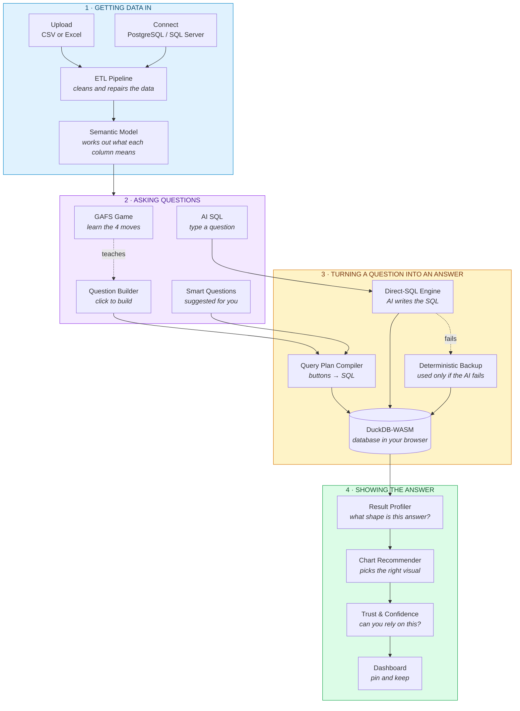
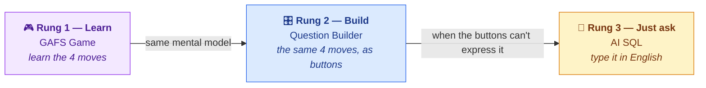
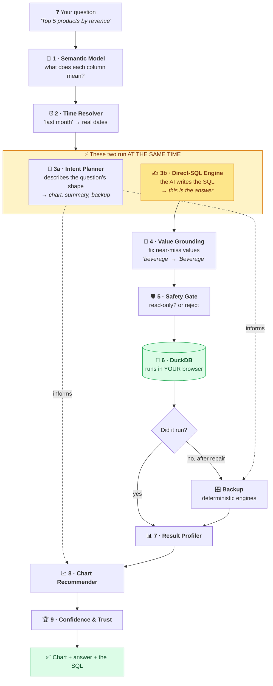
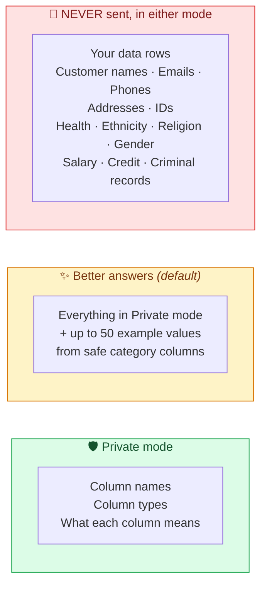

# QuickInsight — How It Works

**A complete guide to the product and the engines behind it.**

This document is written for **everyone**. If you have never written a line of code, start at the top and keep reading — every technical idea is explained with a plain-English analogy and a worked example first. If you are an engineer, the file paths and data structures are called out in each section so you can jump straight to the code.

---

## Table of contents

1. [What QuickInsight is](#1-what-quickinsight-is)
2. [The big picture](#2-the-big-picture)
3. [How your data gets in](#3-how-your-data-gets-in)
4. [The three ways to ask a question](#4-the-three-ways-to-ask-a-question)
5. [Every engine, explained](#5-every-engine-explained)
6. [The AI SQL pipeline, step by step](#6-the-ai-sql-pipeline-step-by-step)
7. [Privacy: exactly what leaves your browser](#7-privacy-exactly-what-leaves-your-browser)
8. [Known gaps and limitations](#8-known-gaps-and-limitations)
9. [Glossary](#9-glossary)

---

## 1. What QuickInsight is

QuickInsight is a business intelligence tool for people who are **not** data analysts.

The problem it solves: a small business owner has a spreadsheet of orders, and a question like *"which of my products actually makes money?"*. Today their options are (a) wrestle with pivot tables, (b) buy a tool built for analysts and never learn it, or (c) hire someone. QuickInsight is a fourth option.

**Three things make it unusual:**

| | What it means |
|---|---|
| **Your data never leaves your computer** | The spreadsheet is loaded into a database that runs *inside your web browser*. Queries run on your own machine. Nothing is uploaded to a server. |
| **It teaches you, it doesn't just answer** | The GAFS game teaches the four moves behind every data question. The Question Builder is those same four moves as buttons. You learn once and use it forever. |
| **Answers are checked, not just generated** | Every answer goes through validation and confidence scoring, and you can always see the exact query that produced it. |

### Who it is for

Non-technical business owners and managers — predominantly spreadsheet and Excel users — who do not have a data team and cannot justify the cost of one.

---

## 2. The big picture

Here is the entire product in one diagram. Each box is explained later.



**The one-sentence version:** your spreadsheet is cleaned, the app works out what each column means, you ask a question three possible ways, one of two engines turns that into a database query, the query runs *in your browser*, and the result is profiled, charted, and checked.

### The technology, briefly

| Piece | What it is | Why it matters to you |
|---|---|---|
| **React + TypeScript + Vite** | The web application itself | — |
| **DuckDB-WASM** | A real analytics database compiled to run inside a browser tab | **This is the key to the privacy story.** Your rows are queried locally, never uploaded. |
| **Chart.js** | The charting library | Draws the visuals |
| **Zustand** | Keeps track of app state | — |
| **Google Gemini** (via a backend proxy) | The AI that writes SQL | Only used by AI SQL; sees *metadata*, never your rows |

---

## 3. How your data gets in

### 3.1 Upload

Drag in a `.csv`, `.xlsx`, or `.xls` file, or connect a live PostgreSQL / SQL Server database. From here on, everything happens in your browser.

### 3.2 The ETL pipeline — the cleaning crew

**ETL** stands for Extract, Transform, Load. Think of it as a **cleaning crew that goes through your spreadsheet before anyone looks at it.**

Real spreadsheets are messy: blank rows at the top, a total row at the bottom, dates written five different ways, numbers stored as text with `£` signs, the same city spelled `London`, `london`, and `LONDON`. If you chart that raw, you get nonsense.

The pipeline runs **seven layers** (`services/etlPipeline.ts`):

```mermaid
graph LR
    L1["1 · Structural<br/>Normalisation"] --> L2["2 · Canonical<br/>Value Prep"]
    L2 --> L3["3 · Column<br/>Profiling"]
    L3 --> L4["4 · Rule Planner<br/>(Classification)"]
    L4 --> L5["5 · Transformation<br/>Engine"]
    L5 --> L5b["5b · Correctness<br/>Hardening"]
    L5b --> L6["6 · Data Contract<br/>Validation"]
    L6 --> L7["7 · Column<br/>Lineage Graph"]

    style L1 fill:#dbeafe,stroke:#2563eb,color:#1e3a8a
    style L4 fill:#fef3c7,stroke:#d97706,color:#78350f
    style L6 fill:#dcfce7,stroke:#16a34a,color:#14532d
```



| Layer | In plain English | Example |
|---|---|---|
| **1 · Structural Normalisation** | Find the real header row, drop junk rows, fix column names | Deletes the two blank rows above your headers |
| **2 · Canonical Value Prep** | Make the same thing look the same | `london`, `London `, `LONDON` → `London` |
| **3 · Column Profiling** | Measure every column — how many distinct values, how many blanks, min/max | "`order_id` has 550 distinct values in 550 rows" |
| **4 · Rule Planner** | Decide what each column *is* | "`order_id` is an identifier, not a number to add up" |
| **5 · Transformation Engine** | Apply the fixes | `"£6.40"` (text) → `6.40` (a number) |
| **5b · Correctness Hardening** | Merge near-duplicates, flag quality problems | Warns you that 12% of `city` is blank |
| **6 · Data Contract Validation** | Final check that the data matches what we decided | Rejects a "date" column where half the values aren't dates |
| **7 · Column Lineage Graph** | Record what was changed and why | You can trace any value back to the original |

**Why this matters:** every wrong answer in BI traces back to dirty data. This runs before you ever see a chart.

### 3.3 The Semantic Model — the app learning what your columns *mean*

`services/ai-sql/semanticLayer.ts` → `buildSemanticModel()`

The ETL pipeline makes your data *clean*. The semantic model makes it *understood*. This is the single most important concept in QuickInsight.

A column called `total_price` is not just "a column of numbers". The app records:

| Property | Meaning | Example |
|---|---|---|
| **Role** | Is it something you *measure*, or something you *group by*? | `total_price` = **metric**. `city` = **dimension**. |
| **Semantic type** | What kind of thing is it really? | currency, quantity, date, category, geography, **identifier** |
| **Default aggregation** | The sensible way to combine it | `total_price` → SUM. `rating` → AVERAGE. |
| **Additivity** | Can you legitimately add it up? | `total_price` yes. **`unit_price` no** — adding per-unit prices is meaningless. |
| **Identifier detection** | Is it unique per row? | `order_id` — never group by it, never add it up |
| **Cardinality** | How many distinct values | `menu_category` has 3; `item_name` has 128 |
| **Synonyms** | Words you might use instead | "revenue", "sales", "takings" → `total_price` |

> **Why this is the foundation of everything.** When you ask *"what was my revenue?"*, the app knows "revenue" means `total_price` (a synonym), that it should be SUMmed (default aggregation), and that summing `unit_price` instead would be wrong (additivity). Both the click-based builder and the AI rely on this same model.

---

## 4. The three ways to ask a question

This is QuickInsight's core idea — a **ladder**. You can get on at any rung, and the rungs teach you to climb.



### 4.1 GAFS — the framework

**Every** analytical question, no matter how complicated it sounds, is made of four moves:

| Letter | Move | The question it answers | Example |
|---|---|---|---|
| **G** | **Grouping** | *What am I comparing?* | by product, by month, by city |
| **A** | **Aggregating** | *What am I measuring?* | total revenue, average order, count |
| **F** | **Filtering** | *Which slice of the data?* | last quarter, London only, Coffee |
| **S** | **Sorting** | *What order, and how many?* | highest first, top 5 |

Take *"What were my top 5 products by revenue in London last quarter?"* — it looks like one hard question. It's four easy ones:

- **G**rouping: by product
- **A**ggregating: sum of revenue
- **F**iltering: city = London, last quarter
- **S**orting: highest first, limit 5

The **GAFS game** (`components/GameView.tsx`) teaches this by drag-and-drop: you're given a question and a set of chips, and you drop each chip into the G, A, F, or S lane. It builds the habit of decomposing questions.

### 4.2 The Question Builder — GAFS as buttons

The builder *is* GAFS made clickable. Pick a metric, a grouping, filters, and a sort order, and it builds the query.

**How it works technically:** your choices become a `UIQueryConfig` object, which `services/queryPlan/buildQueryPlan.ts` turns into a **Query Plan** (a structured description of the query), which `sqlCompiler.ts` turns into SQL. Because it's a fixed set of typed controls, **the SQL is always valid** — there is no guesswork.

**Strength:** completely reliable, instant, free, works offline.
**Limit:** it can only express questions the buttons cover.

### 4.3 AI SQL — type the question

For anything the buttons can't express, type it in plain English. The AI writes the SQL. This is [Section 6](#6-the-ai-sql-pipeline-step-by-step) in full.

### 4.4 Smart Questions

The app reads your semantic model and *suggests* questions worth asking for your data. Good for users who don't yet know what to ask.

---

## 5. Every engine, explained

Each engine below has: **what it does** in plain English, a **worked example**, and **why it exists**.

### 5.1 Semantic Layer
`services/ai-sql/semanticLayer.ts`

**What it does:** works out what every column means (see [3.3](#33-the-semantic-model--the-app-learning-what-your-columns-mean)).
**Example:** reads `unit_price` and records "money, per-unit, do NOT sum".
**Why:** everything downstream depends on it.

### 5.2 Time Resolver
`services/ai-sql/timeResolver.ts`

**What it does:** turns vague time words into real date ranges, *before* any AI is involved.
**Example:** "last month" → `2025-05-01` to `2025-05-31`, calculated from the newest date in your data (not today's date — so demo datasets still work).
**Why:** dates are the most common source of wrong answers. Doing this deterministically removes a whole category of AI error.

### 5.3 Intent Planner
`services/ai-sql/intentPlanner.ts`

**What it does:** asks the AI to describe the *shape* of your question as structured data — is it a ranking, a trend, a breakdown? Which columns are involved?
**Example:** "top 5 products by revenue" → `{intent: "ranking", dimension: product, metric: sum(revenue), limit: 5}`.
**Why:** this drives **chart choice**, the **summary sentence**, **confidence scoring**, and the **backup engine**. Note: it *no longer writes the SQL* — that job moved to the Direct-SQL Engine.

### 5.4 Direct-SQL Engine ⭐
`services/ai-sql/directSqlEngine.ts`

**What it does:** hands the AI your **schema description** (column names, meanings, additivity rules — never your rows) plus your question, and asks it to write SQL directly.
**Example:**

> *"Which customers ordered Coffee but never Tea?"* →
> ```sql
> SELECT customer_name FROM data
> GROUP BY customer_name
> HAVING COUNT(CASE WHEN item_name = 'Coffee' THEN 1 END) > 0
>    AND COUNT(CASE WHEN item_name = 'Tea'    THEN 1 END) = 0
> ```

**Why:** this is the **primary engine** for every AI SQL question. It handles the long tail — window functions, subqueries, set logic — that a fixed set of buttons never could.

### 5.5 Question Builder Mapper + Query Plan Compiler
`services/ai-sql/qbMapper.ts`, `services/queryPlan/`

**What it does:** turns a structured plan into guaranteed-valid SQL using the builder's fixed controls.
**Example:** `{ranking, product, sum(revenue), limit 5}` → a correct `SELECT … GROUP BY … ORDER BY … LIMIT 5`.
**Why:** it powers the click-based Question Builder, and acts as the **deterministic backup** when the AI is unavailable or its SQL won't run.

### 5.6 SQL Correction Engine
`services/ai-sql/sqlCorrectionEngine.ts`

**What it does:** rebuilds SQL from the plan using hard-coded rules, with safety guards baked in — never `SUM()` a text column, never group by a row identifier.
**Why:** the second layer of the backup, for shapes the builder can't express.

### 5.7 Value Grounding
`services/ai-sql/valueGrounding.ts`

**What it does:** two jobs, both **without sending anything anywhere** — matching words in your question against the real values in your data.
1. Recovers filters the plan dropped ("revenue from Delivery" → adds `channel = 'Delivery'`).
2. Fixes near-miss spellings in generated SQL — `'beverage'` → `'Beverage'`, `'Beverages'` → `'Beverage'`.

**Important:** it only corrects a value when there is exactly **one** unambiguous match. It never invents a value.

### 5.8 Anti-Join Detector
`services/ai-sql/antiJoin.ts`

**What it does:** spots "did X but never Y" questions, which need a special SQL shape.
**Example:** "customers who bought Coffee but never Tea".
**Why:** this is a genuinely different query structure that a straightforward filter cannot express.

### 5.9 SQL Safety Gate
`services/ai-sql/sqlSafety.ts`

**What it does:** before *any* AI-written SQL runs, checks that it is read-only.
**Example:** `SELECT …` ✅. `DROP TABLE`, `DELETE`, `UPDATE`, `INSERT`, multiple statements ❌ — rejected, never executed.
**Why:** the AI can never damage your data, even if it produced something bizarre.

### 5.10 Plan Verification
`services/ai-sql/planVerification.ts`

**What it does:** checks whether the plan actually answers the question you asked.
**Example:** you asked for revenue but the plan sums `unit_price` → flagged as an error and confidence drops.
**Why:** the goal is *never a silent wrong answer*. A mismatch becomes a visible warning.

### 5.11 Derived Metric Engine (APDME)
`services/ai-sql/derivedMetricEngine.ts`

**What it does:** handles metrics that need two columns combined, and blocks nonsense aggregations.
**Example:** "average length of stay" → `discharge_date − admission_date`, not `AVG(discharge_date)`.

### 5.12 DuckDB Engine
`services/duckdbEngine.ts`

**What it does:** runs the SQL against your data — **in your browser tab**.
**Why:** this is what makes "your data never leaves your device" true by architecture rather than by promise.

### 5.13 Result Profiler
`services/ai-sql/resultProfiler.ts`

**What it does:** looks at the answer and describes its shape — how many rows, which columns are measures vs labels, is there a time column, is it a single number?
**Why:** the chart recommender needs this to choose sensibly.

### 5.14 Chart Recommender
`services/ai-sql/chartRecommender.ts`

**What it does:** picks the visual from the shape of the result.
**Examples:** one number → KPI card. A time column → line chart. Categories ranked → bar chart. Parts of a whole → doughnut.

### 5.15 Confidence Scorer & Trust Engine
`services/ai-sql/confidenceScorer.ts`, `trustEngine.ts`

**What it does:** scores 0–100 how much you should trust this answer, and shows plain-English checks.
**Penalties applied:** verification errors (−30 each), warnings (−10), guardrail violations, repair attempts.
**Why:** an AI answer with no honesty signal is dangerous for someone who can't read the SQL.

### 5.16 Supporting engines

| Engine | What it does |
|---|---|
| **Insight Discovery** (`insightDiscoveryEngine.ts`) | Finds notable patterns without being asked |
| **Alert Engine** (`alertEngine.ts`) | Threshold and trend alerts on your metrics |
| **Data Masker** (`dataMasker.ts`) | Detects and anonymises PII |
| **Auto Dashboard Builder** (`autoDashboardBuilder.ts`) | Assembles a starter dashboard |
| **Metric Registry** (`metricRegistry.ts`) | ~300 curated business metric templates across industries |

---

## 6. The AI SQL pipeline, step by step

This is the most involved part of the product. Here is what happens between pressing Enter and seeing a chart.



### A worked example

> **You type:** *"Which customers ordered Coffee but never Tea?"*

| Step | What happens |
|---|---|
| **1 · Semantic Model** | `customer_name` = dimension; `item_name` = category with 128 values; `order_id` = row identifier |
| **2 · Time Resolver** | No time words — skipped |
| **3a · Intent Planner** *(parallel)* | Describes it as a filtered breakdown → used for the chart and as backup |
| **3b · Direct-SQL** *(parallel)* | AI receives the schema + question and writes `GROUP BY … HAVING COUNT(CASE WHEN …)` |
| **4 · Value Grounding** | Checks `'Coffee'` and `'Tea'` are real values in your data |
| **5 · Safety Gate** | It's a `SELECT` — allowed |
| **6 · DuckDB** | Runs on all 550 rows locally |
| **7 · Profiler** | 1 text column, no measures → this is a list |
| **8 · Chart** | A list → table view |
| **9 · Trust** | High confidence, no verification errors |

**Two design decisions worth calling out:**

1. **The two AI calls run in parallel.** The SQL writer doesn't need the planner's output, so waiting for one then the other was wasted time. Running them together roughly halves the wait.
2. **The AI's SQL always wins; the deterministic engines are a quiet backup.** They step in *only* if the AI is unavailable, rate-limited, or its SQL fails to run after an automatic repair attempt. That way a failure produces an answer instead of an error.

### Every question is standalone

There is **no conversation memory**. Question #20 costs exactly what question #1 costs, and an answer can never inherit a filter from something you asked earlier. This was a deliberate removal — carrying context caused wrong answers (filters leaking between unrelated questions) and made cost grow through a session.

---

## 7. Privacy: exactly what leaves your browser

**Your data rows are never sent anywhere. Ever.** All queries run in your browser via DuckDB-WASM. That is architecture, not policy.

The AI SQL feature needs *some* description of your data to write SQL. You control how much, with a shield button:



### Why "Better answers" is the default

The AI cannot guess a value it has never seen. Asked *"Coffee vs Tea"*, in Private mode it guesses the literal words `'Coffee'` and `'Tea'` — and if your items are actually named "Cappuccino" and "Green Tea", it matches nothing and you get an empty result. Sharing a short list of **category values** (never people) fixes a large class of everyday questions.

### What is actually shared, concretely

For a table with `customer_name`, `email`, `gender`, `city`, `item_name`, `total_price`, the AI sees the **names of all columns** (it needs them to write SQL) but the **values of only the safe ones**:

| Column | Values shared? | Why |
|---|---|---|
| `city` | ✅ `'London', 'Manchester', 'Leeds'` | Safe category |
| `item_name` | ✅ up to 50 of them | Safe category |
| `customer_name` | ❌ | Person's name |
| `email` | ❌ | Contact detail |
| `gender` | ❌ | Protected characteristic |
| `order_id` | ❌ | Identifier |
| `total_price` | ❌ | Values are never sent for measures |

**Limits, stated honestly:** the sensitive-column detection is **pattern-based on column names**. A column with an unusual name (`ref`, `notes`, `contact_1`) holding personal data could slip through. It is a strong heuristic, not a guarantee. Use Private mode if your data is genuinely sensitive.

**One more thing to know:** the metadata that *is* sent goes to a third-party AI provider via a backend proxy. Confirm their retention terms before making absolute privacy claims to customers.

---

## 8. Known gaps and limitations

Documented honestly — these are real, current, and worth knowing before you rely on the tool.

### 8.1 Accuracy

| Gap | Detail |
|---|---|
| **No measured accuracy figure** | There is currently **no published accuracy number** for the product. The Spider/BIRD benchmark harness that could produce one was removed as unnecessary scope; measuring accuracy would mean rebuilding an evaluation path. |
| **The local intent classifier is approximate** | It classifies by keyword patterns, so unusual phrasings still fall through to `ambiguous` and it can pick the wrong metric. The SQL is unaffected (the AI writes that) — the cost is a less apt chart or summary sentence. The two faults that actively broke answers are fixed: a comparison only counts as a *time* comparison when flanked by time words (so "Coffee vs Tea" stays a category breakdown), no zero-width date range is ever injected, and plain counting questions ("how many customers…") are now recognised. |
| **AI SQL is probabilistic** | Complex multi-step questions (basket analysis, cohort analysis, nested percentages) will sometimes be wrong. Always check the SQL for consequential decisions. |
| **Single-table bias** | Most testing has been on single-table datasets. Multi-table joins are less proven. |

### 8.2 Scale and performance

| Gap | Detail |
|---|---|
| **Browser memory limits** | Data is held in the browser, so the ceiling is this tab's memory. Very large files may be slow. You are now warned at upload above ~500k rows, and more firmly above 1m, rather than discovering it as an unexplained slowdown. |
| **AI latency** | An AI question takes several seconds — bounded by the AI provider, not the app. |
| **Daily AI quota** | AI SQL is capped per user per day. The Question Builder is unlimited and free. |

### 8.3 Privacy

| Gap | Detail |
|---|---|
| **PII detection is heuristic** | Two layers now: column-name patterns, plus a value-level check that inspects the sample itself for emails, phone numbers, postcodes, card numbers, SSNs and IBANs — so a column called `ref` or `notes` holding personal data is still excluded. Strong, but still a heuristic rather than a guarantee. |
| **Third-party AI provider** | Metadata leaves the browser in both modes. Retention terms need confirming. |
| **Date ranges are real data** | The dataset's actual min/max dates are now only sent in *Better answers* mode, alongside the other value domains. In Private mode the model is told a finite range exists but not what it is. |

### 8.4 Product

| Gap | Detail |
|---|---|
| **No local-model option yet** | Running the AI entirely on-device (Ollama / WebGPU) is designed but not built. It would remove the third-party dependency entirely. |
| **Documentation drift** | Older files in `docs/` predate some architecture changes and now carry a banner pointing here. **This document is the current source of truth.** |
| **No conversation/follow-ups** | Deliberate — each question is standalone. If you want to refine, restate the full question. |

---

## 9. Glossary

| Term | Plain English |
|---|---|
| **Aggregation** | Combining many rows into one number — a total, an average, a count |
| **Cardinality** | How many *different* values a column has |
| **Dimension** | Something you group or slice **by** — product, city, month |
| **Metric / Measure** | Something you **measure** — revenue, quantity, count |
| **Additive** | Safe to add up. `total_price` is; `unit_price` is not |
| **Identifier** | A column unique per row (`order_id`) — never group by or sum it |
| **Semantic model** | The app's understanding of what each column means |
| **ETL** | The cleaning process applied before you see anything |
| **DuckDB-WASM** | A real database running inside your browser tab |
| **SQL** | The language databases speak — the app writes it so you don't have to |
| **GAFS** | Grouping, Aggregating, Filtering, Sorting — the four moves in every data question |
| **Query Plan** | A structured description of a query, before it becomes SQL |
| **Token** | The unit AI providers bill in — roughly ¾ of a word |
| **Read-only gate** | The check that AI-written SQL can only read, never modify |

---

## Appendix — where the code lives

| Area | Path |
|---|---|
| AI SQL pipeline (orchestrator) | `services/ai-sql/pipeline.ts` |
| Direct-SQL engine (AI writes SQL) | `services/ai-sql/directSqlEngine.ts` |
| Schema sent to the AI | `services/ai-sql/schemaSerializer.ts` |
| Privacy mode | `services/ai-sql/privacyMode.ts` |
| Semantic model | `services/ai-sql/semanticLayer.ts` |
| Question Builder → SQL | `services/queryPlan/` |
| Deterministic backup | `services/ai-sql/sqlCorrectionEngine.ts`, `qbMapper.ts` |
| ETL pipeline | `services/etlPipeline.ts` |
| In-browser database | `services/duckdbEngine.ts` |
| GAFS game | `components/GameView.tsx` |
| AI SQL screen | `components/AISQLView.tsx` |
| Results screen | `components/VisualPreviewView.tsx` |
| Tests (57 files) | `__tests__/` |

**Running the tests:** `npx vitest run` · **Building:** `npx vite build`
