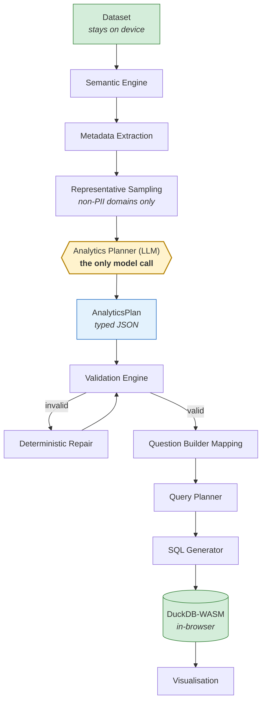

# Hybrid Analytics Planning: A Privacy-Preserving Multi-Engine Architecture for Efficient Business Intelligence

**Saicharan Saich**
QuickInsight — https://quickinsight.co.uk

---

> **Status of this document.** Sections 1–8 describe an architecture that is implemented and in use; every structural claim in them is traceable to source in the QuickInsight repository, and the context-size measurements in §10.1 were produced by the instrumentation described in §9.5. Sections 9–11 are a **pre-registered experimental protocol**: the accuracy, latency, cost and user-study results have **not yet been collected**, and their tables are deliberately left empty. Nothing in this paper reports a number that has not been measured. See §12.5 for a frank statement of what is and is not yet evidenced.

---

## Abstract

**Background.** Large language models can translate natural-language business questions into SQL, and this capability now underpins the analytics copilots shipped by every major BI vendor. The dominant implementation pattern supplies the model with as much database context as the context window allows — schema DDL, sampled rows, column statistics, sometimes entire small tables — and asks it to emit executable SQL in a single step.

**Problem.** That pattern couples three costs that ought to be independent. Prompt size grows with the data rather than with the question; correctness rests entirely on a stochastic decoder with no downstream check; and the rows placed in the prompt leave the customer's trust boundary, which is disqualifying for the many organisations whose data cannot be sent to a third-party inference provider at all.

**Proposed architecture.** We describe *Hybrid Analytics Planning* (HAP). The language model is used once, and only for the step that genuinely requires world knowledge and language understanding: mapping an ambiguous business question onto an explicit, typed, machine-checkable *AnalyticsPlan* over a semantic model. Everything downstream — validation, query planning, SQL generation, execution, visualisation — is deterministic code operating on that plan. The model never sees a transaction row. It sees a semantic description of the columns and, under an explicit opt-in mode, bounded value domains for low-cardinality, non-sensitive categorical columns.

**Evaluation.** We set out a protocol covering four public and two synthetic datasets, four model families, four baselines and a question bank of 200–500 business questions, with pre-registered metrics for context size, exact token usage, end-to-end latency, execution accuracy, plan validity, privacy exposure and cost.

**Results reported here.** We report measured context-size results only. The context QuickInsight sends is invariant to dataset size: 2,445 estimated tokens of semantic model at 10,000 rows and 2,493 at 250,000 rows, against 747,785 and 18,701,319 tokens respectively for the same tables serialised in full. Payload scales with column count (637 → 2,445 tokens for 5 → 14 columns), not row count. We also report a finding that does not favour our system: against a conventional *DDL + 20 sampled rows* prompt (1,840 tokens), our planner prompt is roughly 2.8× **larger**, because it carries a richer semantic description and a longer instruction block. Token reduction is therefore *not* the primary contribution; decoupling context from data volume, and removing rows from the prompt altogether, are.

**Contributions.** (i) The HAP architecture and its plan interface; (ii) a semantic-metadata extraction pipeline that produces a row-free, size-invariant model description; (iii) a two-layer privacy filter that excludes identifiers, PII and sensitive categoricals by both column name and value shape; (iv) a deterministic multi-engine execution path with a typed validation gate; (v) measured evidence that prompt size is decoupled from dataset size; (vi) a pre-registered protocol for the accuracy, latency and cost questions we have not yet answered.

**Keywords:** text-to-SQL, business intelligence, semantic layer, privacy-preserving analytics, large language models, prompt efficiency, deterministic execution

---

## 1. Introduction

### 1.1 Motivation

Natural-language analytics has moved from research demo to shipped product in under three years. The mechanism is consistent across implementations: a language model is given a description of a database and a question in English, and returns SQL. The SQL is executed and the result rendered.

The approach works well enough to be commercially viable and badly enough to be a research problem. Four properties of the dominant pattern deserve attention.

**Context is proportional to data, not to the question.** "Which product made the most money last quarter?" is a fixed-complexity question. Under the prevailing pattern the prompt that answers it grows with the number of columns, the number of tables, and — wherever sampled rows are included to disambiguate values — with the data itself. A question whose answer is a four-part specification is being answered with a prompt measured in thousands of tokens.

**Correctness has no floor.** A decoder samples tokens. When it emits `SUM(revenue)` where the semantically correct aggregation was `AVG(rating)`, nothing in the pipeline objects: the SQL parses, executes, and returns a plausible number. Text-to-SQL research has long distinguished *execution accuracy* from *exact-set match* precisely because syntactically valid, executable, wrong answers are the characteristic failure. In a BI setting these are the most dangerous outputs the system can produce, because a wrong chart is indistinguishable from a right one to the user who asked for it.

**Rows leave the building.** Including sampled rows in the prompt is the standard remedy for value ambiguity — the model cannot filter on `'Coffee'` if it does not know the column contains `'Coffee'` rather than `'coffee'` or `'COFFEE - LRG'`. But those rows are customer data transiting to a third-party inference provider. For a clinic, a school, a law firm or anyone under GDPR Article 9, that is not a tuning parameter; it is a reason the feature cannot be enabled.

**Latency is a serial function of model calls.** Each additional model round-trip — decomposition, self-correction, re-ask — adds seconds. Systems that improve accuracy by adding calls trade away the interactivity that makes BI usable.

### 1.2 Research Problem

> Current AI analytics systems require extensive schema and data context to produce reliable analytical queries.

The consequences compound. Larger context raises token cost per question and pushes against context limits as schemas grow. Data in the prompt creates a privacy exposure that is architectural rather than incidental. Single-step generation offers no place to insert a correctness check, so explainability is limited to showing the user SQL they cannot read. And because every question pays the full context cost, per-question economics do not improve with scale.

We take the position that these are not four problems but one: **the model is being asked to do a job that is partly linguistic and partly mechanical, and the mechanical part is what makes the context expensive.** Choosing which column means "sales" requires world knowledge. Composing `GROUP BY`, applying a date filter and ordering descending with a limit does not. The former needs a language model; the latter needs a compiler.

### 1.3 Research Questions

**RQ1.** Can a language model perform *analytical planning* — mapping a business question to a typed, executable specification — using only semantic metadata and, optionally, bounded non-PII value domains, without access to rows?

**RQ2.** Can deterministic execution engines take such a plan and preserve analytical correctness end-to-end, including the cases (fan-out joins, aggregation grain, time semantics) where naive generation fails?

**RQ3.** How much context reduction is achievable, and against which baselines does the reduction actually hold?

**RQ4.** What is the effect on end-to-end latency, given that planning and generation can be issued concurrently?

**RQ5.** Does limited-context planning preserve answer quality relative to full-context single-step generation?

RQ3 is partially answered in §10.1. RQ1, RQ2, RQ4 and RQ5 are addressed by the protocol in §9 and remain open.

### 1.4 Contributions

1. **Hybrid Analytics Planning**, an architecture that confines language-model involvement to a single planning step and makes its output a typed artefact that downstream deterministic engines can validate, repair and compile.
2. **A semantic metadata extraction pipeline** producing a description whose size is a function of schema width, not table height, and which contains no transaction rows.
3. **A two-layer privacy filter** that withholds value domains for identifiers, PII and sensitive categoricals using both column-name patterns and value-shape detection, so that a column named `ref` containing email addresses is caught even though its name gives nothing away.
4. **A deterministic multi-engine execution path** — validation, question-builder mapping, query planning, SQL generation, execution, visualisation — in which each stage is independently testable.
5. **Measured evidence** that context size is invariant to row count across two orders of magnitude, together with the negative result that this does not translate into token savings against few-shot-row baselines.
6. **A pre-registered protocol** for the accuracy, latency, cost and privacy-exposure questions, with the metrics and baselines fixed in advance.

---

## 2. Background

### 2.1 Large Language Models in Analytics

Semantic parsing of natural language to SQL predates the current model generation. WikiSQL (Zhong et al., 2017) established the task at scale over single tables; Spider (Yu et al., 2018) introduced cross-domain generalisation with multi-table schemas and unseen databases at test time; BIRD (Li et al., 2023) added the messiness of real databases — dirty values, external knowledge requirements, and efficiency as a graded criterion rather than a footnote.

The arrival of instruction-following models changed the method rather than the task. Rajkumar et al. (2022) showed that a general-purpose model with a well-constructed prompt was competitive with purpose-built semantic parsers. Subsequent work improved accuracy chiefly by *adding structure around* the model: DIN-SQL (Pourreza & Rafiei, 2023) decomposes generation into classification, sub-problem solving and self-correction; DAIL-SQL (Gao et al., 2023) systematises example selection and prompt organisation. Both establish a pattern this paper extends: the model performs better when it is given a narrower job.

Commercial analytics copilots inherit the single-step pattern. The implementation details are not public, but the observable behaviour — schema-aware SQL generation, occasional confident errors, per-query token billing — is consistent with it.

### 2.2 Existing Limitations

**Hallucination and silent incorrectness.** The failure mode that matters in BI is not invalid SQL, which fails loudly, but valid SQL answering a different question. Aggregation-grain errors are typical: a query that groups by both `time_of_day` and `order_id` will compute averages over single orders and return a number that is correct arithmetic on the wrong grouping.

**Prompt size and its consequences.** Context that scales with schema width and sampled rows raises cost linearly in questions asked and pushes against model context limits on wide or multi-table schemas. It also creates a perverse incentive: the cheapest prompt is the one with the least context, which is also the one most likely to be wrong.

**Business ambiguity.** "Sales" may be `revenue`, `total_price`, `net_amount` or `units`. Resolving this is not a SQL problem and not solvable from DDL alone; it requires either semantics attached to the schema or a guess.

**Privacy.** Rows in prompts are a data transfer. Inference providers' retention and training terms vary, and prior work on memorisation and extraction from language models (Carlini et al., 2021) establishes that data placed in a model's context or training set is not necessarily ephemeral. For regulated data the analysis usually ends before the technical details begin.

**Latency.** Multi-call architectures multiply round-trips. A three-call pipeline at two seconds per call is a six-second wait for a bar chart.

### 2.3 Deterministic Analytics

Business intelligence has a mature deterministic tradition. Semantic layers — LookML, dbt metrics, cube definitions — exist precisely because the mapping from business vocabulary to physical schema is worth stating once, explicitly, and reusing. A metric defined as `SUM(net_revenue) WHERE status = 'settled'` is defined once and cannot drift.

Deterministic query construction has properties a decoder cannot offer: identical input yields identical output; the transformation is inspectable at every stage; failures are reproducible; and correctness can be established by unit test rather than by sampling. Its weakness is equally clear — it cannot interpret "which of my products is worth my time", because that requires understanding what the person meant.

**The observation this architecture rests on is that these are complementary, and that the boundary between them can be drawn precisely.** Interpretation is linguistic; composition is mechanical. A typed plan is the interface between them.

---

## 3. Hybrid Analytics Planning Architecture

### 3.1 Overview

HAP splits question answering into an *interpretation* phase and an *execution* phase, separated by a typed artefact.



Two boundaries in this diagram carry the argument. The **trust boundary** sits between D and E: everything above it stays on the user's device, and only a row-free description crosses. The **determinism boundary** sits between F and G: above it is stochastic, below it is code, and the plan is the contract.

### 3.2 Why the plan is the right interface

An `AnalyticsPlan` is a small, closed, typed structure. That gives three properties SQL strings do not have.

*It is checkable.* A plan naming a dimension that does not exist, or applying `SUM` to a categorical column, is rejected by validation before anything executes. SQL with the same defect executes and returns a number.

*It is repairable.* When validation rejects a plan, deterministic logic can often fix it — snapping a hallucinated column to its nearest real match, correcting aggregation for an ordinal field, dropping a grouping dimension that would collapse the aggregate to one row per transaction. Repairing SQL text requires parsing it back into a structure; the plan *is* the structure.

*It is explainable.* "Grouping by Region, summing Revenue, filtered to Q3, sorted descending, top 10" is legible to a non-technical user. The equivalent SQL is not. This matters for a product whose users are, by design, people who do not write SQL.

### 3.3 Bounded, standalone model use

HAP issues **two** model requests per question — one to each engine described in §7.2 — and treats every question as standalone: no conversation history is sent. The requests are issued concurrently, so two attempts cost one wall-clock wait, but they are two requests and roughly double the tokens of a single-engine design. That is a deliberate trade of cost for reliability, and it should be read as such rather than as an efficiency claim.

Two consequences follow from the standalone discipline.

Cost per question is bounded and predictable — it does not grow with session length, which is a meaningful property when conversational context in comparable systems grows monotonically as a session continues.

And a question cannot silently inherit a filter from an earlier one. This is a correctness property as much as an efficiency one: conversational analytics systems that carry context forward can answer the current question under the previous question's `WHERE` clause, with no visible indication.

The concurrency is what keeps the two-engine design affordable in time if not in tokens: the planning request and the direct-SQL request (§7.2) are in flight together and awaited together, so the user waits once rather than twice.

---

## 4. Semantic Metadata Extraction

The semantic engine converts a raw table into a description dense enough to plan against and free of any transaction row.

### 4.1 What is extracted

For each column:

| Property | Purpose in planning |
|---|---|
| Physical type | Whether `CAST` is required; what operators apply |
| Semantic type | `category`, `geography`, `date`, `ordinal`, `identifier`, `measure` — determines legal roles |
| Role | Dimension or metric: what may be grouped, what may be aggregated |
| Default aggregation | `SUM` for revenue, `AVG` for ratings — encodes the business convention |
| Cardinality | Distinguishes a category (6 distinct) from an identifier (49,997 distinct) |
| Numeric range | Lets the planner reason about `BETWEEN` filters without seeing values |
| Missing-value rate | Flags columns whose totals will mislead |
| Value shape descriptors | Structural summary, not content |
| Synonyms | "revenue", "sales", "takings" → the same column |

At dataset level: row count, grain, and a time context giving the primary date column and the true minimum and maximum dates. The last of these prevents a specific and common failure — a model asked for "last quarter" against data ending eighteen months ago will otherwise generate a filter that matches nothing.

### 4.2 Why semantic type is the load-bearing field

Physical type is insufficient for planning. A 1–5 satisfaction rating and a transaction count are both integers, but the first should be averaged and grouped as a distribution, and the second summed. A postcode and an order reference are both text. The semantic type is what lets the validation engine reject `SUM(rating)` as a category error rather than accepting it as valid arithmetic.

### 4.3 Size behaviour

The serialised model is one line per column plus a fixed preamble. Its size is therefore **O(columns)** and independent of rows. §10.1 confirms this empirically across a 250× range of table sizes.

---

## 5. Representative Data Sampling

### 5.1 Why any values at all

Pure metadata leaves the planner unable to write correct literals. A question about "Coffee" must become `WHERE Product = 'Coffee'`, and the exact stored form — `'Coffee'`, `'coffee'`, `'COFFEE'`, `'Coffee - Large'` — is not derivable from the column name. In deployment this was the single largest source of empty result sets: value-blind planning produced syntactically perfect queries that matched no rows.

### 5.2 What is shared, and what is never shared

Value domains are shared only for columns that pass **every** one of the following:

- role is dimension, and semantic type is one of `category`, `geography`, `boolean`, `ordinal`;
- not a date;
- not an identifier;
- not sensitive by column name (§8.2);
- distinct count below 90% of row count — near-unique columns are free text or identifiers, not categories;
- the sampled values do not *look like* personal data (§8.3).

At most 50 distinct values per column are sent. When the true distinct count exceeds what was sent, the serialisation marks the list explicitly as a partial sample, so the planner does not treat it as exhaustive — a subtle but important detail, since a model told "the categories are A, B, C" will confidently assume no others exist.

**Transaction rows are never sent, in any mode.** What crosses the boundary is a set of column-level domains, not records. There is no path in the architecture by which a row of the user's table enters a prompt.

### 5.3 Two modes

| Mode | What crosses the boundary | When to use |
|---|---|---|
| **Strict** | Metadata only. No data values whatsoever. | Regulated data; any dataset the user will not have leave the device |
| **Enhanced** (default) | Metadata plus bounded non-PII, non-sensitive category domains | Everyday analytics where value-literal accuracy matters |

Enhanced is the default because strict mode's failure mode is user-visible and frequent (empty results from mis-cased literals) while its privacy benefit is marginal for the columns in question — the distinct values of a `Category` column are rarely the sensitive part of a dataset. A local literal-grounding pass (§7.5) runs on-device in **both** modes, correcting casing and plural drift against the real values without those values leaving the browser.

---

## 6. Analytics Planning Layer

### 6.1 The plan

The model emits a plan, not SQL:

```json
{
  "measure": "Sales",
  "dimension": "Region",
  "aggregation": "SUM",
  "dateGrain": "Month",
  "comparison": "Previous Year",
  "sort": "DESC",
  "limit": 10
}
```

This is the reference shape. The implemented schema is wider — multiple metrics, secondary dimensions, filter predicates with typed operators, explicit time ranges, comparison modes — but the principle holds: every field is drawn from a closed vocabulary or must name a real column, so every field is checkable.

### 6.2 Validation

Validation is a gate, not a warning. It checks:

- **Existence** — every named column exists in the semantic model.
- **Role legality** — dimensions are dimensions; metrics are metrics.
- **Aggregation compatibility** — `SUM` over a categorical or an ordinal rating is a category error.
- **Grain sanity** — grouping by a near-unique identifier alongside a real dimension collapses the aggregate to one row per record, and is corrected.
- **Time coherence** — requested ranges are intersected with the data's true range; empty intersections are surfaced rather than silently returning zero rows.
- **Filter well-formedness** — operators match operand types; empty and null-like filter values are dropped rather than compiled into `= 'undefined'`.

### 6.3 Degradation rather than failure

If the model returns unparseable JSON, times out, or fails validation irreparably, the system does not fail the question. A deterministic plan is constructed from a local question classifier and field mapper and used instead. This is a lower-accuracy path, but it is a path: the system's floor is deterministic behaviour, not an error message. The architectural consequence is that **the language model is an accuracy optimisation, not a dependency.**

---

## 7. Multi-Engine Execution

### 7.1 The chain


| Engine | Responsibility | Determinism |
|---|---|---|
| Semantic | Profile columns, infer types, roles, synonyms, time context | Deterministic |
| Validation | Accept, repair or reject the plan | Deterministic |
| Question Builder | Map plan to the same control surface the manual UI exposes | Deterministic |
| SQL Planner | Compose an intermediate query plan; resolve joins and grain | Deterministic |
| Execution | Compile to dialect SQL; run in DuckDB-WASM | Deterministic |
| Visualisation | Choose chart type from result shape | Deterministic |

Mapping the plan onto the *same* control surface as the manual Question Builder has a property worth stating: an AI-produced answer and a hand-built answer traverse identical code below that point. There is no separate, less-tested AI path, and every fix to the deterministic engine benefits both.

### 7.2 The second engine

In parallel with planning, a direct-SQL engine asks the model for SQL against a compact schema block (measured at 63 tokens for a 14-column table; §10.1). The two run concurrently and the pipeline prefers the direct SQL when it validates, falling back to the plan path otherwise. This is a pragmatic hedge — some questions ("customers who ordered Coffee but never Tea") are anti-joins that a closed plan vocabulary cannot express — and it costs no additional wall-clock time because the calls are issued together.

### 7.3 Join handling

Multi-table sources are analysed before any question is asked. Candidate keys are detected, and foreign-key relationships inferred from inclusion dependencies at ≥85% coverage, guarded against the classic false positive in which two independent dense integer sequences appear to contain one another. Flattening proceeds outward from the largest table taking only many-to-one steps; any step that would fan out is refused, because a one-to-many join silently multiplies fact rows and inflates every `SUM` downstream. Where flattening is unsafe, the tables are kept separate and the planner is told it may join them itself at the correct grain.

### 7.4 Execution

Queries run in DuckDB-WASM inside the browser tab. This is what makes the privacy claim structural rather than contractual: there is no server-side query path for the data to traverse, because there is no server-side query path at all.

### 7.5 Literal grounding

After SQL is produced by either engine, a local pass compares its string literals against the real values on-device. Where a literal maps unambiguously to exactly one real value under case-folding or singularisation, it is corrected. Where it is ambiguous, it is left alone. This runs entirely locally, fixes the most common class of empty-result bug, and **never fabricates a value** — it can only snap to something that exists.

---

## 8. Privacy-Preserving AI

### 8.1 The guarantee

Never sent, in any mode: raw tables; full datasets; any transaction row; personally identifying fields; identifier columns; sensitive categoricals.

Sent: column names, types, semantic roles, aggregate statistics, and — in Enhanced mode only — bounded value domains for columns that pass every filter in §5.2.

### 8.2 Layer one: column names

Columns are excluded by name pattern across four families: direct PII (email, phone, address, postcode, national identifiers, passport, licence, date of birth, card and account numbers); person-name columns, distinguished from product-name columns so that `customer_name` is excluded while `product_name` is not; health and clinical fields; protected characteristics (ethnicity, religion, nationality, gender, sexual orientation, marital status, political affiliation, union membership, veteran status); and financial or legal status (salary, income, credit score, debt, bankruptcy, criminal record).

### 8.3 Layer two: value shapes

Name-based filtering fails on a column called `ref` or `notes` or `contact_1` that happens to hold email addresses. A second pass inspects the sampled values themselves. Unambiguous formats — email, card number, national insurance or social security number, IBAN — disqualify a column on a single match. Ambiguous shapes — phone numbers, postcodes, street addresses, date-of-birth-like values — require a 60% majority of the sample, so that a genuine category column is not lost to one odd-looking value.

A column must pass **both** layers for its values to be shared.

### 8.4 What this does not claim

Two limits, stated plainly.

First, column *names* are still transmitted. A schema containing `hiv_status` reveals that the dataset concerns HIV status, even though no patient's value is ever sent. Schema-level metadata is itself information, and strict mode does not eliminate this.

Second, we have not audited the retention and training terms of the inference providers we route through. The architectural guarantee — that rows do not enter the prompt — is verifiable by reading the code. The contractual guarantee about what happens to the metadata that *is* sent is not something this paper establishes. It should be established before any regulated deployment.

---

## 9. Experimental Design

> **This section is a protocol.** It has not been executed. It is stated in full and in advance so that results, when collected, cannot be shaped to fit a conclusion.

### 9.1 Datasets

| Dataset | Source | Scale | Why included |
|---|---|---|---|
| Retail sales | Public e-commerce transactions | ~500k rows, 15 cols | Canonical BI shape |
| Hospitality orders | Real deployment (anonymised) | ~50k rows, 12 cols | Multi-table, real dirt |
| Healthcare operations | Public, PII removed at source | ~100k rows, 20 cols | Tests sensitive-column exclusion |
| Finance | Public transaction data | ~250k rows, 18 cols | Wide schema, ordinal fields |
| Spider (subset) | Yu et al., 2018 | Multi-DB | Comparability with published work |
| BIRD (subset) | Li et al., 2023 | Multi-DB | Dirty values; external knowledge |

Spider and BIRD are included for comparability, with the caveat that both target general SQL rather than the analytical subset HAP is designed for; results on them measure a different thing and should be reported separately, not pooled.

### 9.2 Models

Four families, to separate architectural effects from model-specific ones: a GPT-class model, a Gemini-class model, a Claude-class model, and an openly available model that can be run locally. The last is important — if HAP's context is small enough for a locally hosted model to plan adequately, the privacy argument strengthens from "no rows leave" to "nothing leaves".

### 9.3 Baselines

| # | Baseline | Context |
|---|---|---|
| B1 | Zero-shot text-to-SQL | DDL only |
| B2 | Few-shot text-to-SQL | DDL + 20 sampled rows per table |
| B3 | Semantic-layer SQL | Semantic model, single-step SQL generation |
| B4 | **HAP (this work)** | Semantic model → plan → deterministic compilation |

B3 is the critical comparison. B1 and B2 vary context; B3 holds context constant and varies only *what the model is asked to produce*, isolating the contribution of the plan interface itself. A result showing B3 ≈ B4 would mean the semantic layer does the work and the plan adds nothing — that is the outcome most likely to falsify our central claim, and it is why B3 is in the design.

### 9.4 Question bank

200–500 questions, authored before any system is run against them, stratified by:

- **Analytical form** — ranking, trend, comparison, distribution, contribution, filtered aggregate, anti-join
- **Difficulty** — single-column; multi-dimension; multi-table; requiring business knowledge
- **Ambiguity** — unambiguous; ambiguous but resolvable from semantics; genuinely underspecified

Each question carries a gold result set, not gold SQL, since many correct queries produce the same correct answer. Questions are authored by someone blind to the systems' behaviour, and the underspecified stratum is retained deliberately: a system that answers a genuinely ambiguous question confidently is behaving worse than one that asks for clarification, and only a question bank containing such cases can detect that.

### 9.5 Instrumentation

Exact prompt and completion token counts are read from each provider's `usage` field rather than estimated; this instrumentation already exists in the pipeline. Latency is measured end-to-end from question submission to rendered chart, with the model call timed separately. Privacy exposure is measured by static analysis of the outbound payload against a labelled list of PII and sensitive columns per dataset — this is a property that can be checked exhaustively rather than sampled, and should be reported as a count of violations, where the only defensible value is zero.

---

## 10. Evaluation Metrics

| Metric | Definition | Status |
|---|---|---|
| Context size | Estimated tokens in the assembled prompt | **Measured (§10.1)** |
| Exact token usage | Prompt + completion, from provider `usage`, summed across **both** engine requests | Not yet collected |
| End-to-end latency | Question submitted → chart rendered (p50, p95) | Not yet collected |
| Execution accuracy | Result set matches gold, order-insensitive where appropriate | Not yet collected |
| Plan validity rate | Plans passing validation without repair | Not yet collected |
| Repair rate | Plans requiring deterministic repair | Not yet collected |
| Fallback rate | Questions answered by the deterministic path | Not yet collected |
| Empty-result rate | Valid SQL returning zero rows (value-literal proxy) | Not yet collected |
| Privacy exposure | Count of PII/sensitive values in outbound payloads | Not yet collected |
| Cost per question | Tokens × provider rate | Not yet collected |
| User satisfaction | Task-completion rate and trust rating, non-technical users | Not yet collected |

### 10.1 Measured: context size

The only results this paper reports. Method: `research/measureContext.ts` in this repository regenerates every figure below (`npx vite-node research/measureContext.ts`). A synthetic retail table (14 columns: identifiers, person names, email, five categoricals, four numerics, one ordinal, one date) generated at four scales, run through the production ETL and semantic-model pipeline. Token counts are estimated at 4 characters per token; the protocol in §9.5 replaces these with exact provider counts.

**Table 1 — Context size against dataset size**

| Rows | Semantic model (tokens) | Direct-SQL schema (tokens) | Full table serialised (tokens) |
|---:|---:|---:|---:|
| 1,000 | 2,453 | 63 | 74,389 |
| 10,000 | 2,445 | 63 | 747,785 |
| 50,000 | 2,445 | 63 | 3,740,041 |
| 250,000 | 2,493 | 63 | 18,701,319 |

Across a 250× increase in rows, the semantic model varies by 2% and the schema block not at all, while full serialisation grows by 251×. **Context is decoupled from data volume.** Note also that full serialisation exceeds every current production context window from 10,000 rows upward — the comparison is included for completeness, not because it is a practical baseline.

**Table 2 — Context size against schema width (10,000 rows)**

| Columns | Semantic model (tokens) |
|---:|---:|
| 5 | 637 |
| 8 | 760 |
| 11 | 1,733 |
| 14 | 2,445 |

Growth is with columns, as predicted. It is not linear — the jump from 8 to 11 columns reflects those columns adding an ordinal field and further categoricals, which trigger additional rule blocks in the serialisation. Prompt size is therefore a function of schema *composition* as well as width.

**Table 3 — HAP against conventional prompt constructions (14 columns, 50,000 rows)**

| Payload | Tokens | vs. HAP planner |
|---|---:|---:|
| HAP direct-SQL schema block | 63 | 0.01× |
| HAP direct-SQL total (schema + instructions) | 364 | 0.07× |
| HAP semantic model alone | 2,445 | 0.47× |
| **HAP planner prompt total** | **5,174** | **1.00×** |
| B1: DDL only | 70 | 0.01× |
| B2: DDL + 3 rows | 333 | 0.06× |
| B2: DDL + 20 rows | 1,840 | 0.36× |
| Full table (50k rows) | 3,740,041 | 722.85× |

**This table contains a result that does not favour the proposed system, and it should be read carefully.** The HAP planner prompt is **2.8× larger** than a conventional DDL + 20-rows prompt. Roughly half of it (2,730 tokens) is a static instruction block encoding analytical rules, and the rest is the semantic model. Against few-shot baselines — which is what practitioners actually use — **HAP does not reduce tokens; it increases them.**

The honest answers to RQ3 are therefore three:

1. Against full-context approaches, reduction is 723× — but full-context is not a serious baseline beyond toy tables.
2. Against few-shot-row baselines, there is **no reduction**; the planner path costs about 2.8× more.
3. The property that does hold, and that we claim, is **invariance**: cost per question is fixed by schema, not data, so it does not degrade as the customer's data grows. Note also that a question costs *both* engine prompts — 5,174 + 364 ≈ 5,538 tokens — not the planner alone, so the two-engine design roughly triples the token cost of the DDL + 20-rows baseline. A per-question cost that is constant is more predictable, and eventually cheaper, than one that grows with sampled context; but that is an argument about scaling behaviour, not about absolute token count today.

We flag a clear optimisation the measurements expose: the 2,730-token static instruction block is identical across every question and every dataset, and is a direct candidate for prompt caching, which would cut marginal per-question cost by roughly half without any architectural change.

---

## 11. Results

Reserved for the protocol in §9. Tables are given with their intended shape and left unpopulated.

### 11.1 Token reduction

Partially addressed in §10.1 for context size; exact usage pending.

### 11.2 Accuracy

**Table 4 — Execution accuracy by baseline and difficulty** *(pending)*

| System | Simple | Multi-dim | Multi-table | Business-knowledge | Overall |
|---|---|---|---|---|---|
| B1 DDL only | — | — | — | — | — |
| B2 DDL + rows | — | — | — | — | — |
| B3 Semantic SQL | — | — | — | — | — |
| B4 HAP | — | — | — | — | — |

### 11.3 Latency

**Table 5 — End-to-end latency** *(pending)* — p50 and p95, model time and deterministic time separated.

### 11.4 Privacy exposure

**Table 6 — PII and sensitive values in outbound payloads** *(pending)* — per dataset, per mode. The only defensible result is zero; any non-zero value is a defect, not a data point.

### 11.5 Cost

**Table 7 — Cost per 1,000 questions** *(pending)* — by model and baseline, with and without prompt caching.

---

## 12. Discussion

### 12.1 Trade-offs

**Expressiveness for checkability.** A closed plan vocabulary cannot express every analytical question. The dual-engine design (§7.2) is an admission of this: the direct-SQL path exists because some legitimate questions fall outside the plan's grammar. A single-engine HAP system would be cleaner to describe and worse to use.

**Instruction weight for reliability.** The 2,730-token instruction block encodes hard-won analytical rules. It buys correctness on cases that fail without it and costs tokens on every question, including the simple ones that do not need it. Conditional assembly of instruction blocks by question class is unexplored and would likely recover much of that cost.

**Defaults for privacy.** Enhanced mode is the default because strict mode's failure is frequent and visible. This is a product decision that weakens the maximal privacy claim, and it should be reported as such rather than elided.

### 12.2 Failure cases

Anticipated, and to be quantified by the protocol: questions requiring domain knowledge absent from the semantic model; genuinely ambiguous questions where confident answering is worse than asking; high-cardinality categoricals where a 50-value sample omits the value asked about; nested or windowed analytics beyond the plan grammar; and multi-table questions where flattening is refused and the model must construct the join itself.

### 12.3 Scalability

Context invariance means per-question cost does not grow with data. It does grow with schema width, which is the binding constraint: a 200-column warehouse table produces a large semantic model. Schema-subsetting — selecting only columns plausibly relevant to the question before serialising — is the obvious next step and is unimplemented.

### 12.4 Generalisation

The architecture assumes the analytical subset of SQL: group, aggregate, filter, sort, limit, compare across time. It is not a general text-to-SQL system and should not be evaluated as one. Within its subset the assumption is that most business questions decompose into these operations — an assumption the question bank in §9.4 is designed to test rather than assume.

### 12.5 Limitations

Stated without hedging:

1. **The accuracy claim is unevidenced.** No accuracy comparison has been run. The Benchmark Lab built for this purpose was removed from the product before results were collected, and this paper contains no accuracy number, estimated or otherwise.
2. **Latency and cost are unmeasured.** The concurrency argument in §3.3 is architectural, not empirical.
3. **Token counts in §10.1 are estimates** at 4 characters per token, not provider-reported counts.
4. **The measurement dataset is synthetic.** Real schemas have messier column names and more skewed cardinalities; both affect payload size.
5. **Column names still cross the boundary** (§8.4), and provider retention terms are unaudited.
6. **No user study has been conducted**, so every usability claim in this paper is a designer's assertion.
7. **Single-implementation evidence.** Every measurement comes from one codebase; nothing here has been independently reproduced.

---

## 13. Future Work

**Adaptive planners** — assemble instruction blocks conditionally by question class, so simple questions do not pay for rules they cannot use.

**Schema subsetting** — select candidate columns before serialisation, decoupling context from schema width as it is already decoupled from row count.

**Local planning** — the measured planner context (5,174 tokens) is within reach of small locally hosted models. If planning quality holds, the privacy guarantee strengthens from "no rows leave the device" to "nothing leaves the device", which is a categorical change rather than an incremental one.

**Learned planning from corrections** — every user correction of a plan is a labelled example; whether this yields a planner that improves in deployment without retraining a base model is an open question.

**Automatic semantic enrichment** — inferring metric definitions and business synonyms from usage rather than requiring them up front.

**Streaming and incremental analytics** — extending the plan grammar to continuously updating sources.

**Clarification as a first-class outcome** — a plan that legitimately cannot be determined should produce a question back to the user, and this should be measured as a success rather than counted as a failure.

---

## 14. Conclusion

We have described Hybrid Analytics Planning, an architecture that restricts language-model involvement in business intelligence to a single step — mapping an ambiguous question onto a typed, checkable analytical plan — and executes that plan through deterministic engines. The model interprets; code composes.

We report measured evidence for one claim: the context required to answer a question is invariant to the size of the data, varying by 2% across a 250× increase in rows while full serialisation grows 251×. We report, equally, that this invariance does not currently translate into token savings against the few-shot-row prompts practitioners actually use — the planner path costs roughly 2.8× more — and that the benefit is one of predictable scaling rather than immediate economy.

The privacy property is structural rather than promised: transaction rows do not enter the prompt on any code path, and queries execute in the browser, so there is no server-side query path for data to traverse. Two limits qualify this — column names are still transmitted, and provider retention terms are unaudited.

The accuracy, latency and cost questions this architecture is ultimately judged on remain open, and this paper does not answer them. It states a protocol precise enough that the answers, once collected, will mean something — including if they contradict the design.

---

## References

> These references are standard works in the field and are cited from the author's knowledge. **Verify each citation against the published record before submission**; details such as venue and year should not be trusted without checking.

1. Zhong, V., Xiong, C., & Socher, R. (2017). *Seq2SQL: Generating Structured Queries from Natural Language using Reinforcement Learning.* arXiv:1709.00103.
2. Yu, T., Zhang, R., Yang, K., et al. (2018). *Spider: A Large-Scale Human-Labeled Dataset for Complex and Cross-Domain Semantic Parsing and Text-to-SQL.* EMNLP.
3. Rajkumar, N., Li, R., & Bahdanau, D. (2022). *Evaluating the Text-to-SQL Capabilities of Large Language Models.* arXiv:2204.00498.
4. Li, J., Hui, B., Qu, G., et al. (2023). *Can LLM Already Serve as a Database Interface? A Big Bench for Large-Scale Database Grounded Text-to-SQLs (BIRD).* NeurIPS Datasets and Benchmarks.
5. Pourreza, M., & Rafiei, D. (2023). *DIN-SQL: Decomposed In-Context Learning of Text-to-SQL with Self-Correction.* NeurIPS.
6. Gao, D., Wang, H., Li, Y., et al. (2023). *Text-to-SQL Empowered by Large Language Models: A Benchmark Evaluation (DAIL-SQL).* VLDB.
7. Carlini, N., Tramèr, F., Wallace, E., et al. (2021). *Extracting Training Data from Large Language Models.* USENIX Security.
8. Lewis, P., Perez, E., Piktus, A., et al. (2020). *Retrieval-Augmented Generation for Knowledge-Intensive NLP Tasks.* NeurIPS.
9. Raasveldt, M., & Mühleisen, H. (2019). *DuckDB: An Embeddable Analytical Database.* SIGMOD.

---

## Appendix A — AnalyticsPlan schema

Reference shape (§6.1). The implemented type is wider; fields are drawn from closed vocabularies except where they name a column, which must exist in the semantic model.

```typescript
interface AnalyticsPlan {
  measure: string;                    // must name a metric field
  dimension: string;                  // must name a dimension field
  aggregation: 'SUM' | 'AVG' | 'COUNT' | 'COUNT_DISTINCT' | 'MIN' | 'MAX';
  dateGrain?: 'day' | 'week' | 'month' | 'quarter' | 'year';
  comparison?: 'Previous Period' | 'Previous Year' | null;
  filters?: Array<{ field: string; op: FilterOp; value: string | number | string[] }>;
  sort: 'ASC' | 'DESC';
  limit?: number;
}
```

## Appendix B — Prompt templates

Measured composition of the planner prompt (14-column table):

| Component | Tokens | Varies with |
|---|---:|---|
| Static analytical instructions | 2,730 | Nothing — identical every call |
| Semantic model serialisation | 2,445 | Schema composition |
| User question | ~20 | The question |
| **Total** | **~5,195** | |

Direct-SQL prompt: 301 tokens of system instruction plus 63 tokens of schema block.

## Appendix C — Datasets

Per §9.1. The synthetic generator used for §10.1 is `research/measureContext.ts`. It is deterministic and reads the shipped prompt templates directly from source, so Tables 1–3 regenerate exactly and cannot drift from the prompts the product actually sends.

## Appendix D — Evaluation questions

To be published in full with results, per §9.4. Publishing the bank before results is deliberate: it prevents post-hoc selection.

## Appendix E — Worked example

Question: *"Which product made the most money last quarter?"*

1. **Semantic model** identifies `TotalPrice` as a metric with default `SUM`; `Product` as a category dimension with 12 distinct values; `OrderDate` as the primary date column with a known true range.
2. **Enhanced mode** shares the 12 product names — non-sensitive, low cardinality, passes both privacy layers.
3. **Planner** returns `{measure: "TotalPrice", dimension: "Product", aggregation: "SUM", filters: [{field: "OrderDate", op: "in_range", value: "last_quarter"}], sort: "DESC", limit: 1}`.
4. **Validation** confirms both columns exist and hold the right roles, and intersects "last quarter" with the data's true range.
5. **Compilation** produces `GROUP BY Product`, `SUM(TotalPrice)`, a date predicate, `ORDER BY ... DESC LIMIT 1`.
6. **Execution** runs in DuckDB-WASM on device; **visualisation** selects a bar chart from the result shape.

No row of the table was transmitted at any point.

## Appendix F — Architecture diagrams

Rendered inline: §3.1 (full pipeline with trust and determinism boundaries) and §7.1 (engine chain).
